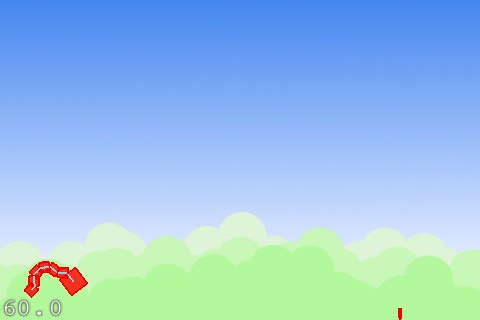

# Natural Selection

Archive of the **Natural Selection** iPhone project (also called _Trilobite_), developed by Jason Brownlee circa 2009.

Research for this project became the _Mobile Game Engines_ project.

## About

(from the original webpage)

The Natural Selection project will deliver an application that is an evolution simulator for the iPhone and iTouch platforms, providing light entertainment in a game like environment.

Natural Selection provides a selection of 2D environments and challenges for a virtual creature to adapt to and solve using an evolutionary process. Example environments include walking, swimming, flying, jumping, following, carrying an object, and fighting. The environment defines a virtual 2D space including a plane, obstacles, gravity, friction, and weather. Creatures are defined by a base body plan (head, body, arms, legs) in terms of 2D geometrical shapes that are connected via simulated muscles. The evolutionary process operates upon a genetic code that defines a given creatures body plan and muscle sensor-to-actuator configuration.

The user selects an environment and a base body plan from their respective libraries and watches as the creature adapts, specialising to the constraints of an environment under an evolutionary process. The user interacts with the process directly by manipulating the parameters of the evolutionary process. The parameters for the environment can be modified in real-time, changing the objective and constraints imposed on the creature under the evolutionary process.

Creatures and environments can be saved with screenshot and a symbolic name that can be used to load the creatures and/or environments in a later simulation. Creatures can be shared with friends via electronic communication such as email.

## Code Summary

The code is written in Objective-C, making use of the **cocos2d-iphone** game engine and **Box2D** physics engine.

An implementation prepared between March and May 2009 by Jason Brownlee, and was code named Trilobite. This was the main effort to realize the natural selection project. It was built using XCode 3.1.2, the iPhone SDK 2.1.1, cocos2d-iphone 0.7.2, and box2d (from SVN).

The build provided a working iPhone application with a menu system, a playground, and a series of five mock levels. The playground provided a creature testing ground for users where any creature in the library could be added to a box-world where it was affected by gravity (iphone accelerometer) and being moved (user touch). Five mock levels with a single flag objective were provided for testing purposes. These included: blocks (creature has to jump across blocks), leap (jump from a height), stairs (climb up stairs), pond (creature has to cross a pond), and windmill (bypass a spinning windmill).

A single creature was provided nick-named _worm_ that consisted of a series of blocks strung together in a worm shape, each attached using a revolute joint, all of which activated in sequence to give the creature worm like movement.

The code provided a framework for the evolution game (rendering and physics), although did not implement the evolutionary component. Two open problems halted progress: 1) how to integrate the evolutionary computation into the main rendering loop to be consistent across different iPhone hardware (run at the same speed), and 2) how to speed up the execution of the physics engine to allow creature assessment in faster than realtime (in the background).

The source code was open sourced under the MIT License by Jason Brownlee in September 2009 in an effort to 1) provide sample code to interested developers, 2) foster interest, 3) deliver something given the initial investment.

The following is a screenshot of v0.1, taken on an iPhone 3G.

## Design Docs

Backup of my personal design docs for the project.

* [Design Docs](code/NaturalSelectionProject/) ([Download](NaturalSelectionProject-20090324.zip))

## Code

I think these are backups from my HDD, not of the github repo. Not sure.

* [Trilobite-0.1.zip](code/Trilobite-0.1.zip)
* [Trilobite-0.2.tar.gz](code/Trilobite-0.2.tar.gz)
* [Trilobite-0.3.zip](code/Trilobite-0.3.zip)
* [Trilobite-0.4.zip](code/Trilobite-0.4.zip)
* [Trilobite-0.5.tar.gz](code/Trilobite-0.5.tar.gz)
* [Trilobite-0.6.tar.gz](code/Trilobite-0.6.tar.gz)

An update of the codebase was made in 2010 to make it work with more recent versions of the ios operating system and libraries, but that version has been lost.

## Sources

### Project Homepage

* [http://github.com/jbrownlee/natural-selection](https://web.archive.org/web/20091009070630/http://github.com/jbrownlee/natural-selection) (archived)

### Blog Posts

* [iPhone Resurrection and New iPhone App Project](https://web.archive.org/web/20100127103343/http://www.neverreadpassively.com/2009/03/iphone-resurrection-and-new-iphone-app.html) March 22, 2009. (archived)
* [3D Virtual Creature Evolution Part 1: Videos](https://web.archive.org/web/20090728212802/http://www.neverreadpassively.com/2009/03/3d-virtual-creature-evolution-part-1.html) March 23, 2009. (archived)
* [Review of 3D Engines for the iPhone](https://web.archive.org/web/20100125014042/http://www.neverreadpassively.com/2009/03/review-of-iphone-3d-engines.html) March 28, 2009. (archived)
* [Oolong Engine for the iPhone: A First Look](https://web.archive.org/web/20100126033646/http://www.neverreadpassively.com/2009/04/oolong-engine-for-iphone-first-look.html) April 5, 2009. (archived)
* [Dropping a Dimension: Cocos2D and Box2D on iPhone](https://web.archive.org/web/20100126054147/http://www.neverreadpassively.com/2009/04/dropping-dimension-cocos2d-and-box2d-on.html) April 19, 2009. (archived)
* [Natural Selection: Project Status Update](https://web.archive.org/web/20090922233035/http://www.neverreadpassively.com/2009/05/natural-selection-project-status-update.html) May 1st, 2009. (archived)
* [iPhone Resurrection and New iPhone App Project](https://web.archive.org/web/20090602081312/http://www.neverreadpassively.com/2009/03/iphone-resurrection-and-new-iphone-app.html) March 22 2009. (archived)
